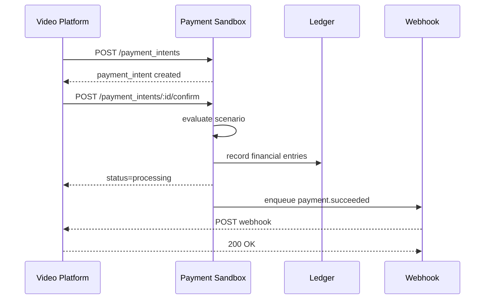

> ASK: Me encuentro diseñando y desarrollando una aplicación, la cual pretende ser algo así como varias capacidades o bounded contexts, por ejemplo, órdenes, pagos, identidades, en otras palabras, una plataforma donde un usuario cliente puede comprar un servicio de edición de videos y en esa misma compra decide qué cantidad de tipos de video, etcétera. Entonces, en alguna parte, yo hago dos integraciones, una con Mercado Pago y la otra con Stripe, y una tercera con lo que pudiera ser criptomonedas. Ahora, volviendo al tema de los proveedores, para la etapa de testing, yo desarrollé un fake provider que lo que hace es responder siempre true o siempre false, dependiendo el test que estoy desarrollando. Y luego se me ocurrió una forma de probarlo en etapas de desarrollo, que es no forzando el true o el false, sino efectivamente con un procesador de pagos. Es decir, yo lo que pretendo es iniciar otra Rails app, o no sé si me conviene más hacerlo con Rust o con qué, pero que en definitiva lo que hace es recibir hits de intentos de pago con tarjetas de crédito, por ejemplo. Entonces, yo lo que tendría sería que tomar ese saldo, hacer algún tipo de asiento contable, tener una suerte de billetera o balance para diferentes identidades, y bueno, calculo que algún tipo de reportes o algo que se manejan en esos procesos de pagos. Por ejemplo, yo desde la aplicación que estoy trabajando actualmente, en algún momento tengo que hacer un invoice o un billing al cliente por haberme comprado el servicio. Pero yo me imagino que tanto Stripe como Mercado Pago también hacen o generan sus invoices, sus reportes, sus billings, pero yo no conozco de cuáles involucraría. Así se acierta, siento yo que hay que crear como una especie de hoja de balance para una identidad, por ejemplo, la identidad del número de la tarjeta de crédito o no lo sé exactamente, pero bueno, por ahí. Entonces, ¿qué me permite esto? Es, entre otras cosas, entender el dominio de lo que es ser un proveedor de pagos o de servicios de pagos, o no sé cómo llamarlo, y de esa manera poder también tener un esquema/pipelines para poder hacerlo con criptomonedas posteriormente.

---

Sí: la idea tiene mucho valor, pero conviene precisar qué sistema estás construyendo.

No sería solamente un FakePaymentProvider más sofisticado. Estarías creando algo parecido a un:

> Payment Processor Simulator o Payment Sandbox Platform

Es decir, una plataforma local que simula el comportamiento observable de Stripe, Mercado Pago o un procesador cripto, sin intentar implementar realmente las redes de tarjetas, bancos o blockchains.

Esto te permitiría aprender y probar:

- autorización y captura;
- pagos pendientes, rechazados y aprobados;
- refunds;
- contracargos;
- fees;
- balances;
- settlement;
- conciliación;
- webhooks;
- idempotencia;
- invoices y reportes;
- futuros flujos con criptomonedas.

## 1. Hay tres niveles de testing diferentes

Tu fake provider actual sigue siendo correcto. No deberías reemplazarlo.

## Nivel 1: fake determinista

```
FakePaymentProvider.new(result: :approved)
FakePaymentProvider.new(result: :declined)
FakePaymentProvider.new(result: :pending)
```

Sirve para:

- unit tests;
- use case tests;
- probar caminos concretos;
- ejecutar la suite rápidamente;
- no depender de HTTP ni procesos externos.

Un test debe poder decir explícitamente:

```
provider = FakePaymentProvider.approved
```

No debería depender de reglas implícitas como “si el monto termina en 07, rechazar”.

## Nivel 2: procesador local simulado

Tu segunda aplicación representaría este nivel.

```
Video Commerce Platform
          │
          │ HTTP
          ▼
Local Payment Processor
          │
          ├── Payment Intents
          ├── Authorizations
          ├── Captures
          ├── Refunds
          ├── Ledger
          ├── Balances
          ├── Settlements
          └── Webhooks
```

Sirve para desarrollo, demos, pruebas de integración, resiliencia y conciliación.

## Nivel 3: sandboxes reales

Finalmente deberías ejecutar algunos tests contra:

- Stripe Test Mode;
- Mercado Pago Test Accounts;
- eventualmente una blockchain local o testnet.

Mercado Pago ya provee cuentas, tarjetas y saldos ficticios para probar distintos resultados. Incluso utiliza datos específicos del titular para provocar pagos aprobados, pendientes o rechazados.

Por lo tanto, tu procesador local no reemplaza esos sandboxes. Cumple otra función: darte control total, velocidad, escenarios reproducibles y visibilidad sobre el dominio interno.

⸻

# 2. Qué debería simular realmente

Yo separaría cuatro conceptos que suelen confundirse.

## Payment gateway

Es la interfaz por la que tu aplicación solicita el pago.

```
POST /v1/payment_intents
POST /v1/payment_intents/:id/confirm
POST /v1/refunds
```

## Payment processor

Decide y procesa la operación:

```
authorized
declined
pending
captured
reversed
refunded
```

## Ledger

Registra el efecto financiero.

El payment intent dice:

> “Se intentó cobrar USD 100”.

El ledger dice:

> “USD 100 se movieron desde una cuenta lógica hacia otra, se descontaron USD 3 de comisión y quedaron USD 97 pendientes de liquidación”.

## Settlement system

Determina cuándo el dinero pasa a estar disponible para el vendedor.

```
pending balance
      ↓
available balance
      ↓
payout
      ↓
merchant bank account
```

Tu MVP podría incluir los cuatro, aunque con un procesador deliberadamente simplificado.

⸻

# 3. No usaría la tarjeta como identidad financiera

Esta parte es importante.

No conviene modelar:

```
Balance → card_number
```

Una tarjeta es un instrumento de pago, no la identidad económica principal.

El modelo sería más parecido a:

```
Customer
└── PaymentMethod
    └── CardToken
```

Y por otro lado:

```
Merchant
└── MerchantAccount
    ├── pending balance
    ├── available balance
    └── reserved balance
```

Entidades recomendadas:

```
Platform
Merchant
Customer
PaymentMethod
PaymentIntent
PaymentAttempt
Charge
Refund
Dispute
LedgerAccount
LedgerTransaction
LedgerEntry
Settlement
Payout
Invoice
Fee
WebhookEndpoint
WebhookDelivery
```

El número de tarjeta real ni siquiera debería llegar a tu aplicación principal. En tu simulador puedes utilizar tokens ficticios:

```
pm_card_visa
pm_card_insufficient_funds
pm_card_expired
pm_card_processing_error
```

O tarjetas completamente ficticias exclusivas del entorno local.

⸻

# 4. El núcleo debería ser el ledger

La pieza más educativa y reusable de todo el proyecto no sería el endpoint de pagos, sino un ledger de doble entrada.

Supongamos una compra de USD 100 con una comisión del procesador de USD 3.

## Cuando el pago es capturado

```
Debit Processor Clearing Account 100
Credit Merchant Pending Balance 97
Credit Processor Fee Revenue 3
```

Luego, cuando se libera el dinero:

```
Debit Merchant Pending Balance 97
Credit Merchant Available Balance 97
```

Cuando se realiza el payout:

```
Debit Merchant Available Balance 97
Credit Payout Clearing Account 97
```

Y cuando se confirma la transferencia bancaria:

```
Debit Payout Clearing Account 97
Credit External Bank Settlement 97
```

Cada movimiento debería cumplir:

```
total_debits == total_credits
```

Nunca actualizaría un balance directamente de esta manera:

```
merchant.update!(balance: merchant.balance + amount)
```

El balance debería ser una proyección del ledger:

```
balance = credits.sum(:amount) - debits.sum(:amount)
```

O una proyección materializada, siempre reconciliable contra los entries originales.

⸻

# 5. Payment Intent, Attempt y Charge no son lo mismo

Esta separación te va a ahorrar muchos problemas.

## PaymentIntent

Representa el objetivo comercial:

```
Cobrar USD 100 por la orden ORD-123
```

Puede sobrevivir a varios intentos.

```
PaymentIntent

- id
- merchant_id
- customer_id
- order_reference
- amount
- currency
- status
- capture_method
- idempotency_key
```

## PaymentAttempt

Cada intento técnico:

```
Intento 1 → timeout
Intento 2 → tarjeta rechazada
Intento 3 → aprobado
```

```
PaymentAttempt

- payment_intent_id
- payment_method_id
- status
- decline_code
- processor_reference
- requested_at
- responded_at
```

## Charge

La obligación financiera efectivamente creada.

```
Charge

- payment_intent_id
- payment_attempt_id
- amount
- captured_amount
- refunded_amount
- status
```

No todo intento genera un charge, y no todo charge está capturado inmediatamente.

⸻

# 6. Estados recomendados

Un simple true o false no representa suficientemente el dominio.

## Payment Intent

```
requires_payment_method
requires_confirmation
processing
requires_capture
succeeded
cancelled
failed
```

## Payment Attempt

```
created
submitted
authorized
declined
timed_out
errored
```

## Charge

```
authorized
captured
partially_refunded
refunded
reversed
disputed
```

## Settlement

```
scheduled
pending
available
paid
failed
reversed
```

Esto encaja particularmente bien con tu arquitectura orientada a:

```
intent + workflow + outcome
```

La orden de tu plataforma representa el flujo comercial. El payment intent representa el flujo del procesador. Deben relacionarse, pero no convertirse en la misma entidad.

⸻

# 7. Tu invoice y la invoice del proveedor son documentos distintos

Aquí hay otra separación fundamental.

## Invoice de tu plataforma al cliente

Tu plataforma vende edición de video:

```
Invoice INV-1001

2 clips verticales        USD 40
1 video resumen           USD 60
--------------------------------
Total                    USD 100
```

Esta invoice pertenece al bounded context de billing de tu plataforma.

## Charge o payment receipt

Documenta que el pago fue procesado:

```
Payment receipt

Payment intent: pi_123
Charge: ch_123
Amount: USD 100
Status: captured
```

No necesariamente es una factura fiscal.

## Invoice del procesador al merchant

El procesador puede cobrarte:

```
Processing fees for July

Gross processed       USD 10,000
Processing fees       USD    300
Taxes                 USD     63
Total billed          USD    363
```

Esta es una invoice del proveedor de pagos hacia tu empresa, no hacia el comprador de los videos.

## Settlement report

Explica cómo llegaste desde ventas brutas hasta dinero disponible:

```
Gross payments            10,000
Refunds                     -500
Chargebacks                 -200
Processing fees             -300
Net settlement             9,000
```

Mercado Pago, por ejemplo, ofrece reportes de transacciones, dinero disponible, liquidaciones y movimientos que afectaron el balance; esos reportes sirven especialmente para conciliación y muestran conceptos como pagos, devoluciones, contracargos y montos brutos y netos.

Por eso, en tu sistema deberían existir por separado:

```
CustomerInvoice
PaymentReceipt
ProcessorFeeInvoice
SettlementReport
LedgerReport
```

⸻

# 8. Arquitectura que recomiendo

No empezaría con microservicios. Haría una segunda aplicación Rails modular.

```
payment-sandbox/
├── app/
│ ├── domains/
│ │ ├── identities/
│ │ ├── payments/
│ │ ├── ledger/
│ │ ├── settlements/
│ │ ├── billing/
│ │ ├── disputes/
│ │ ├── webhooks/
│ │ └── reporting/
│ │
│ ├── controllers/
│ │ └── api/v1/
│ │ ├── payment_intents_controller.rb
│ │ ├── refunds_controller.rb
│ │ ├── balances_controller.rb
│ │ └── reports_controller.rb
│ │
│ └── jobs/
│ ├── process_payment_job.rb
│ ├── capture_payment_job.rb
│ ├── release_funds_job.rb
│ ├── process_payout_job.rb
│ └── deliver_webhook_job.rb
│
├── config/
│ └── scenarios.yml
│
└── spec/
├── contracts/
├── requests/
├── domains/
└── system/
```

El flujo sería:



⸻

# 9. Rails, Rust o alguna otra tecnología

Comenzaría con Rails

Para este caso Rails te da:

- Active Record y transacciones;
- jobs;
- API rápidamente;
- administración;
- migraciones;
- buena expresividad de dominio;
- reutilización de conocimientos;
- posibilidad de inspeccionar manualmente ledger entries y balances.

Rust no te aporta demasiado al principio. El problema principal no es rendimiento, sino:

- modelado financiero;
- consistencia;
- estados;
- idempotencia;
- auditabilidad;
- conciliación.

Más adelante Rust podría aparecer en:

- motor de reglas;
- procesamiento masivo;
- simulador de alto volumen;
- firma criptográfica;
- indexación blockchain;
- componentes críticos del ledger.

Pero comenzar en Rust aumentaría el coste antes de comprender suficientemente el dominio.

Mi elección concreta sería:

```
Ruby on Rails
PostgreSQL
GoodJob / Faktory / Sidekiq
Docker Compose
OpenAPI
RSpec
Cucumber para happy paths críticos
```

⸻

# 10. Escenarios controlables

La gran mejora respecto de always_true sería soportar escenarios declarativos.

```
scenarios:
  successful_card:
    authorization: approved
    capture: succeeded
    settlement_delay: 2_days
    fee_percentage: 2.9
    fixed_fee: 0.30

  insufficient_funds:
    authorization: declined
    decline_code: insufficient_funds

  delayed_payment:
    authorization: processing
    transition_after: 30_seconds
    final_status: succeeded

  lost_webhook:
    authorization: approved
    capture: succeeded
    webhook:
      delivery: skipped

  duplicated_webhook:
    authorization: approved
    capture: succeeded
    webhook:
      deliveries: 3
```

La plataforma cliente podría seleccionar el escenario mediante:

```
X-Sandbox-Scenario: delayed_payment
```

O usando un payment method:

```json
{
  "payment_method": "pm_card_insufficient_funds"
}
```

También deberías simular:

- respuestas HTTP 500;
- timeout;
- respuesta exitosa seguida de webhook tardío;
- webhook duplicado;
- webhook fuera de orden;
- charge aprobado aunque la respuesta HTTP se haya perdido;
- refund parcial;
- disputa posterior;
- payout fallido;
- monedas no soportadas;
- idempotency key repetida;
- monto o moneda inconsistentes.

Estos escenarios son más valiosos que un mero true/false, porque representan los problemas reales de una integración distribuida.

⸻

# 11. Cómo conecta esto con criptomonedas

La ventaja de este diseño es que el comercio no necesita entender si el dinero llegó por tarjeta, Mercado Pago o blockchain.

```
PaymentIntent
├── CardPaymentRail
├── MercadoPagoRail
├── StripeRail
└── CryptoPaymentRail
```

En cripto cambiaría la mecánica:

```
payment intent created
      ↓
deposit address generated
      ↓
transaction detected
      ↓
confirmations pending
      ↓
confirmed
      ↓
funds credited
```

Pero el resultado económico puede seguir entrando al mismo ledger:

```
Debit Crypto Custody Asset
Credit Merchant Pending Balance
```

Luego podrías agregar:

```
BlockchainNetwork
Wallet
Address
OnChainTransaction
Confirmation
GasFee
ExchangeRateQuote
CryptoDeposit
CryptoWithdrawal
```

La abstracción correcta no sería “todo es una tarjeta”, sino:

```
module PaymentRail
  def create_payment(...)
  def confirm_payment(...)
  def refund(...)
  def fetch_status(...)
end
```

Cada rail traduce su realidad específica hacia eventos normalizados:

```
payment.processing
payment.authorized
payment.captured
payment.failed
payment.refunded
funds.available
payout.completed
```

⸻

# 12. Alcance del MVP

No intentaría implementar inicialmente:

- clearing bancario real;
- redes Visa o Mastercard;
- tokenización PCI real;
- fraude avanzado;
- KYC real;
- impuestos reales;
- emisión fiscal;
- FX complejo;
- custodia real;
- blockchain mainnet;
- chargebacks con evidencias completas.

Construiría estas cinco fases.

## Fase 1 — Processor API

```
Merchant
Customer
PaymentMethod
PaymentIntent
PaymentAttempt
Charge
Webhook
```

Estados configurables y endpoints compatibles con tu aplicación.

## Fase 2 — Ledger

```
LedgerAccount
LedgerTransaction
LedgerEntry
```

Doble entrada, balances y auditoría.

## Fase 3 — Refunds y settlements

```
Refund
Fee
Settlement
Payout
```

Balances pending, available y reserved.

## Fase 4 — Reporting y conciliación

```
transaction report
balance report
settlement report
fee report
reconciliation report
```

## Fase 5 — Crypto rail

Primero con una blockchain local:

```
Anvil
deposit address
fake confirmations
gas fees
deposit reconciliation
```

Después podrías conectar una testnet.

⸻

# 13. Mi recomendación final

La idea es buena tanto como herramienta de testing como proyecto de aprendizaje, con una condición:

No lo diseñes como una copia completa de Stripe, sino como un simulador de rails de pago alrededor de un ledger común.

Mantendría tres componentes separados:

```
1. FakePaymentProvider
   Tests rápidos y deterministas.

2. LocalPaymentSandbox
   Integración, webhooks, balances, settlement y fallos distribuidos.

3. Real Provider Sandboxes
   Verificación contractual contra Stripe y Mercado Pago.
```

Y dentro del simulador, el corazón conceptual sería:

```
Payment orchestration
        +
Double-entry ledger
        +
Settlement lifecycle
        +
Webhook simulation
        +
Reconciliation reports
```

Ese diseño no solamente te ayuda a probar la plataforma de edición de videos. También se transforma en un proyecto de portfolio muy fuerte para demostrar conocimientos de payment systems, fintech architecture, distributed systems, accounting ledgers, reconciliation e integración blockchain.
