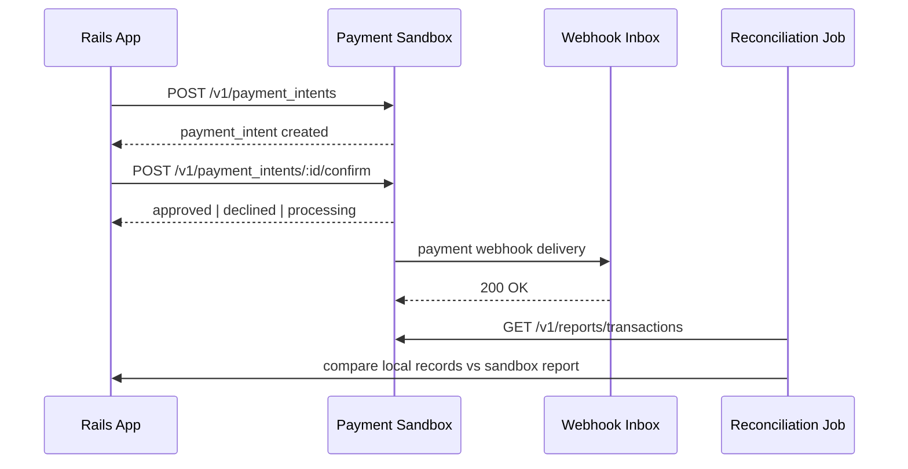

# Epic: Payment Sandbox Integration MVP

## Intent

Build a local card-payment sandbox in Go that the existing Rails app can call as if it were a PSP.
The goal is to model the shared payment lifecycle, webhook delivery, and reconciliation flow without
depending on Stripe or Mercado Pago in development.

## Scope

### In Scope

- [ ] Card-only payment sandbox service in Go.
- [ ] 5 core endpoints for create, confirm, capture, refund, and reporting.
- [ ] Webhook simulation with retries and duplicate delivery.
- [ ] Local ledger-style reporting for reconciliation.
- [ ] Rails adapter contract for payment requests and webhooks.
- [ ] 6 deterministic scenarios for success, decline, pending, retries, and partial refund.
- [ ] Docker Compose for local execution.

## Stories

- [x] [01-sandbox-api-base](./stories/01-sandbox-api-base/README.md) `done`
- [ ] [02-scenario-engine](./stories/02-scenario-engine/README.md) `pending`
- [ ] [03-webhook-delivery](./stories/03-webhook-delivery/README.md) `pending`
- [ ] [04-ledger-reporting](./stories/04-ledger-reporting/README.md) `pending`
- [ ] [05-rails-adapter](./stories/05-rails-adapter/README.md) `pending`
- [ ] [06-local-dev-setup](./stories/06-local-dev-setup/README.md) `pending`

Each story includes its own system design diagram followed by a numbered explanation.

### Out of Scope

- [ ] Crypto rails.
- [ ] Real card network, PCI, or bank settlement behavior.
- [ ] Production deployment or staging infrastructure.
- [ ] Provider-specific edge cases that are not part of the common card flow.

## Proposed Contract

### Go Sandbox Endpoints

- [ ] `POST /v1/payment_intents`
- [ ] `POST /v1/payment_intents/:id/confirm`
- [ ] `POST /v1/payment_intents/:id/capture`
- [ ] `POST /v1/refunds`
- [ ] `GET /v1/reports/transactions`

### Scenarios

- [ ] `approved_immediate`
- [ ] `declined_insufficient_funds`
- [ ] `requires_action_3ds`
- [ ] `processing_then_succeeded`
- [ ] `duplicate_webhook_delivery`
- [ ] `partial_refund`

## Rails Adapter Contract

Rails should expose a small gateway interface around the sandbox:

- [ ] `create_intent`
- [ ] `confirm_intent`
- [ ] `capture_intent`
- [ ] `refund`
- [ ] `fetch_status`

Rails should also persist:

- [ ] payment intents
- [ ] payment attempts
- [ ] webhook inbox entries
- [ ] local reconciliation snapshots

## Approach

Keep the first version as a single service, not microservices.
Go handles the sandbox API, scenario engine, webhook delivery, and transaction reports.
Rails owns the business flow, local tracking, and reconciliation against the Go report.

## Affected Areas

| Area                                                | Impact   | Description                                                |
| --------------------------------------------------- | -------- | ---------------------------------------------------------- |
| `docs/epics/001-payment-sandbox-integration-mvp/README.md` | New      | Epic proposal and scope definition.                        |
| `Go sandbox service`                                | New      | Payment processor simulator, scenarios, webhooks, reports. |
| `Rails payment adapter`                             | Modified | Client wrapper and local payment tracking.                 |
| `Rails webhook handling`                            | Modified | Inbox/idempotency for sandbox events.                      |
| `Rails reconciliation job`                          | Modified | Compare local state with sandbox report.                   |

## Risks

| Risk                                                | Likelihood | Mitigation                                                 |
| --------------------------------------------------- | ---------- | ---------------------------------------------------------- |
| Scope expands into full Stripe/Mercado Pago parity  | Medium     | Start with the shared card lifecycle only.                 |
| Webhook duplication causes inconsistent local state | High       | Store delivery IDs and process idempotently.               |
| Rails and Go drift in status names or transitions   | Medium     | Lock the contract with fixtures and request specs.         |
| Reporting becomes too broad too early               | Medium     | Limit reporting to transaction/reconciliation data in MVP. |

## Rollback Plan

Keep the existing Rails fake provider behind the current adapter boundary.
If the Go sandbox causes instability, switch the Rails app back to the old fake provider, disable webhook consumption, and preserve the local payment tables for later reconciliation.

## Dependencies

- [ ] Existing Rails payment flow and local attempt tracking.
- [ ] Docker Compose for local service orchestration.
- [ ] Agreement on the common card-flow states and webhook names.

## Success Criteria

- [ ] Rails can create, confirm, capture, and refund against the Go sandbox.
- [ ] The sandbox emits reproducible webhook events for the 6 scenarios.
- [ ] Rails can reconcile local payment records against `GET /v1/reports/transactions`.
- [ ] The MVP runs locally with Docker Compose.
- [ ] The contract is stable enough to later add Stripe and Mercado Pago adapters.
