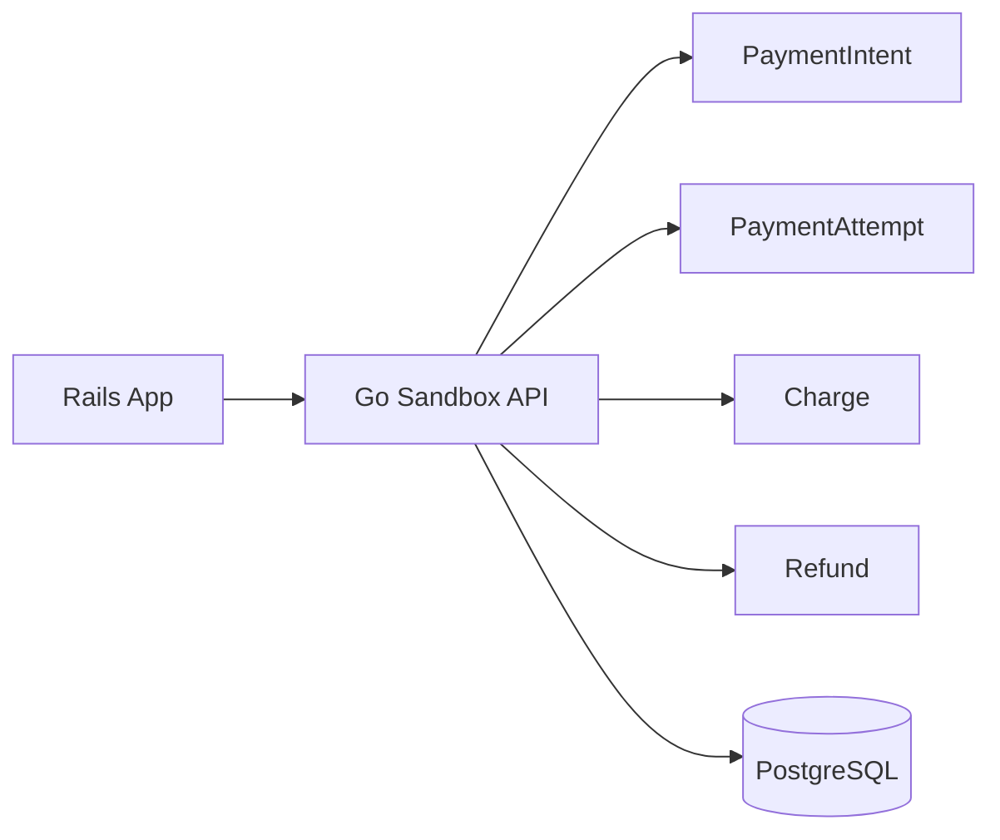

# Story: Sandbox API Base

## Intent

Implement the core payment intent API used by Rails to create, confirm, capture, and refund payments.

## Scope

### In Scope

- [ ] `POST /v1/payment_intents`
- [ ] `POST /v1/payment_intents/:id/confirm`
- [ ] `POST /v1/payment_intents/:id/capture`
- [ ] `POST /v1/refunds`
- [ ] Core models and validations for intents, attempts, charges, and refunds

### Out of Scope

- [ ] Webhook delivery
- [ ] Reporting and reconciliation
- [ ] Rails adapter implementation

## System Design

## Explanation

1. Rails calls the Go sandbox through a small payment API.
2. The API translates each request into domain objects such as intents, attempts, charges, and refunds.
3. PostgreSQL stores the canonical state for the sandbox lifecycle.
4. The API remains thin so later stories can add scenarios, webhooks, and reporting without changing the basic contract.

## Acceptance Criteria

- [ ] Rails can create and progress a payment intent.
- [ ] Refunds are registered and linked to the original charge.
- [ ] Invalid transitions are rejected.

## Dependencies

- [ ] Shared domain model for payment lifecycle
