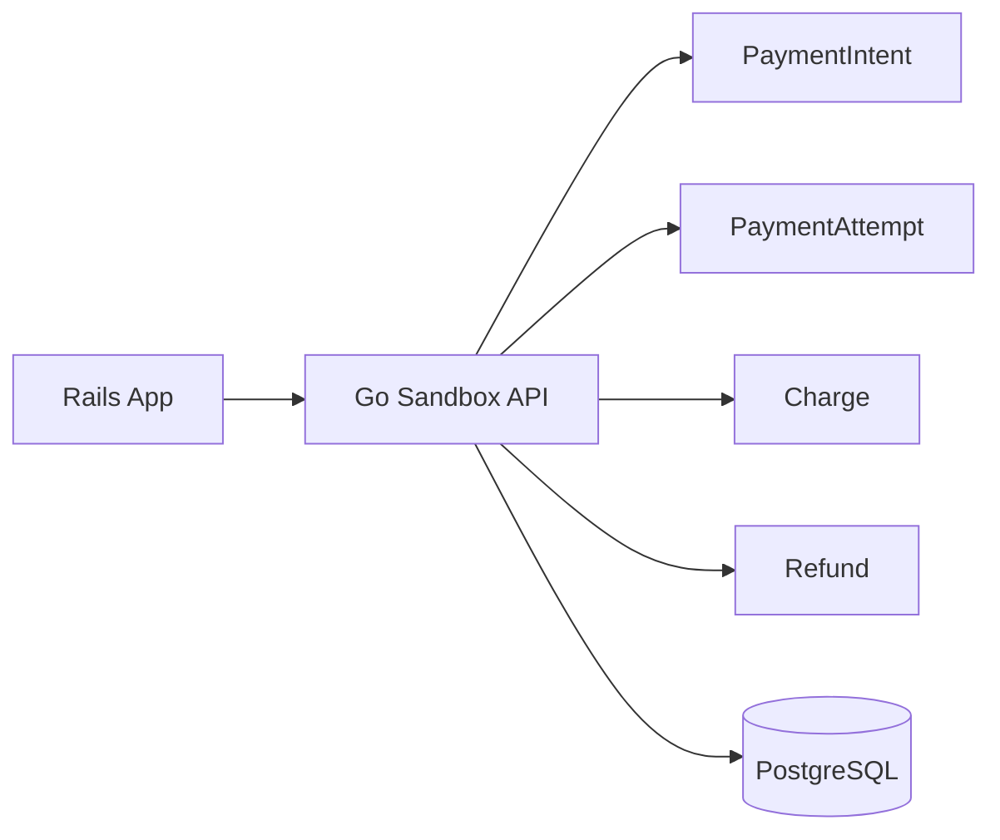

# Story: Sandbox API Base

## Intent

Implement the core payment API that Rails uses to create, confirm, capture, and refund card payments against the sandbox.

## Scope

### In Scope

- [x] `POST /v1/payment_intents`
- [x] `POST /v1/payment_intents/:id/confirm`
- [x] `POST /v1/payment_intents/:id/capture`
- [x] `POST /v1/refunds`
- [x] Domain models for `PaymentIntent`, `PaymentAttempt`, `Charge`, and `Refund`
- [x] Validations for amount, currency, state transitions, and required references
- [x] Basic idempotency for create, confirm, and refund requests

### Out of Scope

- [ ] Webhook delivery
- [ ] Reporting and reconciliation
- [ ] Rails adapter implementation
- [ ] Scenario selection logic
- [ ] Ledger projections

## System Design

## Explanation

1. Rails calls the sandbox through a narrow payment API instead of talking to domain tables directly.
2. `PaymentIntent` holds the commercial goal, while `PaymentAttempt` captures each technical try.
3. `Charge` represents the financial obligation created by a successful or authorized attempt.
4. `Refund` references the original charge and tracks reversals independently.
5. PostgreSQL is the source of truth for this story, and the API stays thin so later stories can add scenarios, webhooks, and reporting without breaking the contract.

## Contract Notes

- `PaymentIntent` should move through explicit states such as `requires_payment_method`, `requires_confirmation`, `processing`, `requires_capture`, `succeeded`, `cancelled`, and `failed`.
- `PaymentAttempt` should record the processor response, decline reason, and timestamps.
- `Refund` should support full and partial amounts, always linked to the original charge.
- Invalid transitions must fail fast with a stable error payload.

## Acceptance Criteria

- [x] Rails can create and progress a payment intent.
- [x] Refunds are registered and linked to the original charge.
- [x] Invalid transitions are rejected.
- [x] Duplicate create/confirm/refund requests do not create duplicate financial effects.
- [x] The API returns predictable error payloads for invalid state transitions.

## Implementation Note

- The sandbox base is implemented as a self-contained Go service with an in-memory store and a storage abstraction boundary, so the PostgreSQL-backed version can be added later without changing the HTTP contract.

## Outcomes

- [Demo README](./outcomes/README.md)
- [01-create-payment-intent.http](./outcomes/01-create-payment-intent.http)
- [02-confirm-payment-intent.http](./outcomes/02-confirm-payment-intent.http)
- [03-capture-payment-intent.http](./outcomes/03-capture-payment-intent.http)
- [04-refund-payment-intent.http](./outcomes/04-refund-payment-intent.http)

## Dependencies

- [ ] Shared domain model for payment lifecycle
