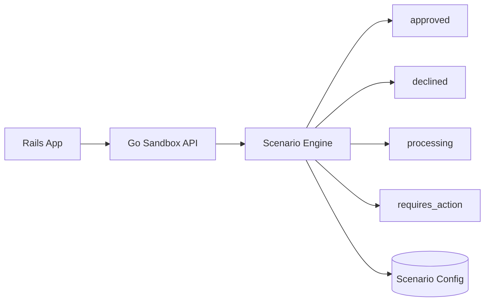

# Story: Scenario Engine

## Intent

Make the sandbox deterministic by driving payment outcomes from named scenarios.

## Scope

### In Scope

- [ ] `approved_immediate`
- [ ] `declined_insufficient_funds`
- [ ] `requires_action_3ds`
- [ ] `processing_then_succeeded`
- [ ] Scenario selection via header or payment method token
- [ ] Deterministic mapping from scenario input to outcome

### Out of Scope

- [ ] Real fraud or risk scoring
- [ ] Crypto scenarios
- [ ] Provider-specific edge cases beyond the shared card flow
- [ ] Webhook delivery
- [ ] Ledger projections

## System Design

## Explanation

1. Rails passes a scenario marker with the payment request.
2. The scenario engine maps that marker to a deterministic outcome.
3. The engine may emit immediate success, rejection, or delayed processing.
4. Scenario config stays external so new flows can be added without changing the core API.
5. This keeps payment behavior reproducible across development, demos, and tests.

## Contract Notes

- Scenario selection should accept either a header or a payment method token.
- The same scenario input must always produce the same outcome.
- Scenario definitions should be externalized in config, not hardcoded in controllers.
- Unknown scenarios should fail fast with a stable error payload.

## Acceptance Criteria

- [ ] The sandbox returns the expected status for each named scenario.
- [ ] Scenario selection is deterministic and reproducible.
- [ ] Pending flows can transition to a final state later.
- [ ] Unknown scenario names are rejected clearly.
- [ ] Scenario config can be changed without modifying the API contract.

## Dependencies

- [ ] Sandbox API base
