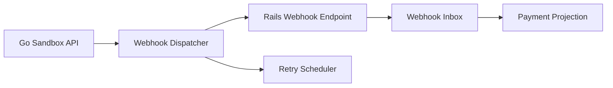

# Story: Webhook Delivery

## Intent

Simulate provider webhooks with retries, duplicates, and idempotent processing on the Rails side.

## Scope

### In Scope

- [ ] `payment.succeeded`
- [ ] `payment.failed`
- [ ] `payment.processing`
- [ ] Retry delivery
- [ ] Duplicate delivery
- [ ] Webhook inbox in Rails
- [ ] Delivery signature verification

### Out of Scope

- [ ] Complex signature standards beyond a simple shared secret
- [ ] External queue infrastructure
- [ ] Third-party webhook providers beyond the sandbox contract

## System Design

## Explanation

1. The sandbox emits payment events after a lifecycle transition.
2. A dispatcher sends the event to Rails and tracks delivery attempts.
3. Rails stores every delivery in an inbox before applying business changes.
4. If the webhook fails, the dispatcher retries without breaking idempotency.
5. The local payment projection is updated only from validated inbox entries.

## Contract Notes

- Webhooks should be signed with a shared secret.
- Each delivery needs a unique delivery id for idempotency.
- Retries must reuse the same event payload and only vary the delivery metadata.
- Rails should accept duplicated events without duplicating business effects.
- Failed deliveries should be visible in the inbox for later inspection.

## Acceptance Criteria

- [ ] Rails can receive and store webhook deliveries.
- [ ] Duplicate events do not duplicate business effects.
- [ ] Failed deliveries are retried.
- [ ] Webhook signatures are validated before applying business state changes.
- [ ] Delivery attempts are visible for debugging and reconciliation.

## Dependencies

- [ ] Sandbox API base
- [ ] Scenario engine
