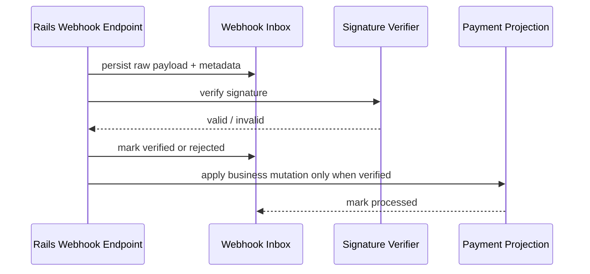

# Webhook Inbox Contract

## Goal

Define the Rails-side inbox/verifier flow that stores each webhook before business mutation, rejects duplicates, validates signatures, and exposes delivery history.

## Responsibilities

- Persist the raw webhook payload first.
- Verify the signature before any domain mutation.
- Deduplicate by `delivery_id` and `event_id`.
- Keep delivery history queryable for debugging and reconciliation.

## Inbox Record Shape

The inbox should store at least:

- `id`
- `delivery_id`
- `event_id`
- `event_type`
- `schema_version`
- `payload_raw`
- `signature`
- `attempt`
- `status`
- `received_at`
- `verified_at`
- `processed_at`
- `failure_reason`

## Suggested States

- `received` - webhook persisted, not yet verified.
- `verified` - signature accepted, ready for processing.
- `processed` - business mutation applied successfully.
- `duplicate` - webhook ignored because it was already seen.
- `rejected_signature` - signature invalid or missing.
- `failed` - verified but processing failed.

## Processing Flow

## Rules

1. Persist raw payload before any domain write.
2. Reject duplicates before reapplying side effects.
3. Validate the signature before mutating state.
4. Keep the inbox entry and delivery metadata available for later inspection.
5. Never let the inbox mutate business state without verification.

## Debugging Expectations

- Operators should be able to query deliveries by `delivery_id` or `event_id`.
- Failed or duplicate deliveries should remain visible.
- A processed inbox entry should point to the affected local payment projection record.

## Notes

- This contract is Rails-side only.
- It complements `WEBHOOK_CONTRACT.md` and `WEBHOOK_SIGNATURE.md`.
- It does not define provider-specific business logic beyond the common sandbox events.
- A Ruby contract stub lives in `webhook_inbox_contract.rb` to keep the expected Rails API visible in this repo.
