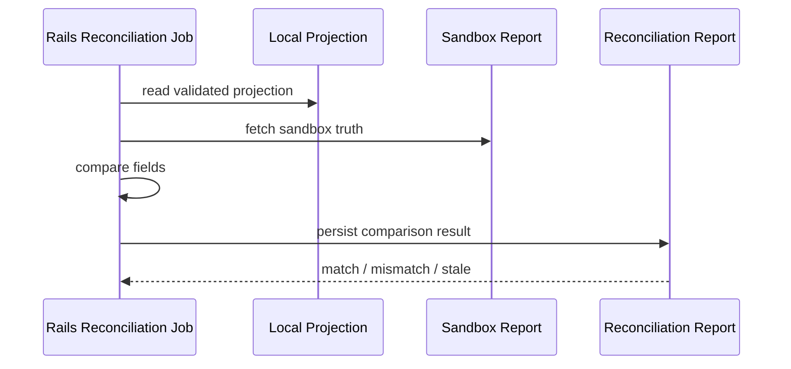

# Webhook Reconciliation Contract

## Goal

Define the Rails reconciliation flow that reads the validated payment projection, compares it with sandbox truth, and reports mismatches without mutating business state.

## Purpose

- Compare local projection state with sandbox reports.
- Detect drift early.
- Keep reconciliation read-only.
- Preserve a queryable history of comparisons.

## Inputs

Reconciliation consumes:

- the local projection defined in `WEBHOOK_PROJECTION_CONTRACT.md`
- the latest validated inbox entries that produced that projection
- sandbox truth from `GET /v1/reports/transactions` or the equivalent contract report

## Required Comparison Fields

The reconciliation diff should compare at least:

- `payment_intent_id`
- `status`
- `latest_attempt_id`
- `charge_id`
- `amount`
- `captured_amount`
- `refunded_amount`
- `currency`
- last applied `delivery_id`
- last applied `event_id`

## Report Shape

Reconciliation should emit a report record with at least:

- `id`
- `payment_intent_id`
- `projection_snapshot`
- `sandbox_snapshot`
- `status`
- `mismatch_type`
- `created_at`
- `updated_at`

## Suggested Statuses

- `match` - the projection and sandbox truth are aligned.
- `mismatch` - at least one comparable field diverges.
- `missing_local` - the sandbox has truth but the local projection is absent.
- `missing_remote` - the local projection exists but the sandbox report is absent.
- `stale` - the projection is older than the newest sandbox truth.

## Suggested Mismatch Types

- `status_drift`
- `amount_drift`
- `capture_drift`
- `refund_drift`
- `attempt_drift`
- `missing_inbox_context`

## Rules

1. Reconciliation must read from the projection, not from raw webhook payloads.
2. Reconciliation must not mutate the projection or inbox.
3. Reconciliation may create a separate snapshot/report record.
4. A mismatch should be visible without changing business truth.
5. The latest applied inbox metadata should be part of the diff context.

## Flow

## Operator Expectations

- Operators should be able to query reconciliation reports by `payment_intent_id`.
- The report should show what changed, not just that something changed.
- A mismatch should include enough context to debug the inbox event that produced the projection.

## Notes

- This contract is Rails-side only.
- It depends on the projection contract but does not define projection mutation.
- It does not define the job scheduler or retry behavior for reconciliation itself.
