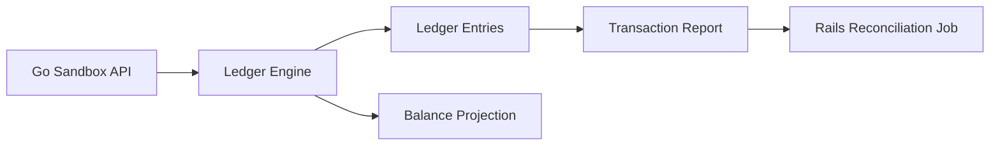

# Story: Ledger and Reporting

## Intent

Add a simple ledger and reporting layer so Rails can reconcile local records against sandbox truth.

## Scope

### In Scope

- [ ] Double-entry ledger entries
- [ ] Transaction report endpoint
- [ ] Balance projection
- [ ] Reconciliation snapshot export

### Out of Scope

- [ ] Bank settlement files
- [ ] Full accounting back office

## System Design

## Explanation

1. Payment actions write immutable ledger entries.
2. The ledger engine validates debits and credits remain balanced.
3. The report endpoint exposes payment and balance state for reconciliation.
4. Rails compares the report with its own local projections.
5. Balances are derived from the ledger, not updated directly.

## Acceptance Criteria

- [ ] Every financial movement is reflected in the ledger.
- [ ] The report can be consumed by Rails for reconciliation.
- [ ] Balances can be derived from entries.

## Dependencies

- [ ] Sandbox API base
- [ ] Rails adapter
