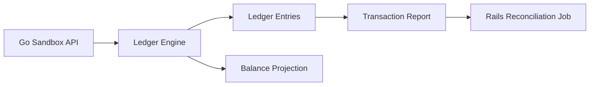

# Story: Ledger and Reporting

## Intent

Add a simple ledger and reporting layer so Rails can reconcile local records against sandbox truth.

## Current Status

- Transaction report, balance projection, daily settlement projection, and reconciliation snapshot export are implemented.
- Immutable ledger entries are now appended from create, confirm, capture, and refund flows.
- Balance projection is now derived from ledger entries.
- Transaction report now exposes fee lines alongside refunds.
- Reconciliation snapshot export is available through `GET /v1/reports/transactions?view=snapshot`.
- The story is complete.

## Scope

### In Scope

- [x] Double-entry ledger entries
- [x] Transaction report endpoint [Evidence](./TRANSACTION_REPORT_CONTRACT.md)
- [x] Balance projection [Evidence](./BALANCE_PROJECTION_CONTRACT.md)
- [x] Daily settlement projection [Evidence](./SETTLEMENT_PROJECTION_CONTRACT.md)
- [x] Reconciliation snapshot export
- [x] Immutable financial movements
- [x] Reportable fees and refunds

### Out of Scope

- [ ] Bank settlement files
- [ ] Full accounting back office
- [ ] External accounting integrations
- [ ] Tax or invoice generation

## System Design

## Explanation

1. Payment actions write immutable ledger entries.
2. The ledger engine validates debits and credits remain balanced.
3. The report endpoint exposes payment and balance state for reconciliation.
4. Rails compares the report with its own local projections.
5. Balances are derived from the ledger, not updated directly.
6. Fees, refunds, and reversals must remain traceable to their originating transaction.

## Contract Notes

- Ledger entries must be append-only.
- A balance is a projection of entries, not a primary source of truth.
- The transaction report must include enough data for reconciliation.
- Every report line must be traceable back to one or more ledger entries.
- Reconciliation snapshots should be exportable and comparable from Rails.

## Acceptance Criteria

- [x] Every financial movement is reflected in the ledger.
- [x] The report can be consumed by Rails for reconciliation.
- [x] Balances can be derived from entries.
- [x] Ledger entries remain immutable.
- [x] Fees and refunds are represented in the report.

## Dependencies

- [ ] Sandbox API base
- [ ] Rails adapter

## Related Docs

- [Transaction Report Contract](./TRANSACTION_REPORT_CONTRACT.md)
- [Balance Projection Contract](./BALANCE_PROJECTION_CONTRACT.md)
- [Settlement Projection Contract](./SETTLEMENT_PROJECTION_CONTRACT.md)
- [Implementation Checklist](./IMPLEMENTATION_CHECKLIST.md)
