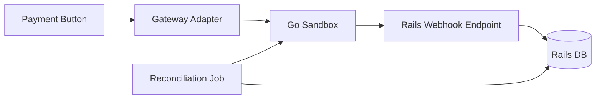

# Story: Rails Adapter

## Intent

Create the Rails-side adapter, local persistence, and reconciliation job that talks to the sandbox.

## Scope

### In Scope

- [ ] `create_intent`
- [ ] `confirm_intent`
- [ ] `capture_intent`
- [ ] `refund`
- [ ] `fetch_status`
- [ ] Local payment intents and attempts
- [ ] Reconciliation job

### Out of Scope

- [ ] Provider-specific SDKs
- [ ] UI changes beyond the existing payment button flow

## System Design

## Explanation

1. The existing payment button uses a gateway adapter instead of calling the sandbox directly.
2. The adapter keeps the Rails code decoupled from the Go implementation.
3. Webhooks update Rails state asynchronously after the initial request.
4. A reconciliation job compares Rails data with sandbox reports.
5. The adapter boundary makes it easy to later swap in Stripe or Mercado Pago.

## Acceptance Criteria

- [ ] Rails can drive the sandbox through a gateway interface.
- [ ] Local payment state is persisted consistently.
- [ ] Reconciliation can detect mismatches.

## Dependencies

- [ ] Sandbox API base
- [ ] Webhook delivery
- [ ] Ledger and reporting
