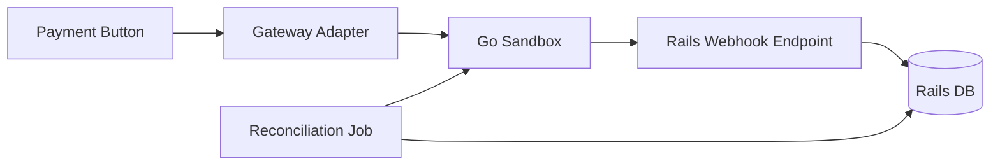

# Story: Rails Adapter

## Intent

Create the Rails-side adapter, local persistence, and reconciliation job that talks to the sandbox.

## Scope

### In Scope

- [ ] `create_intent`
- [ ] `confirm_intent`
- [ ] `capture_intent`
- [ ] `refund`
- [ ] `fetch_status`
- [ ] Local payment intents and attempts
- [ ] Reconciliation job
- [ ] Adapter error mapping
- [ ] Local idempotency key tracking

### Out of Scope

- [ ] Provider-specific SDKs
- [ ] UI changes beyond the existing payment button flow
- [ ] Provider-specific payment logic
- [ ] Webhook dispatcher implementation in the sandbox

## System Design

## Explanation

1. The existing payment button uses a gateway adapter instead of calling the sandbox directly.
2. The adapter keeps the Rails code decoupled from the Go implementation.
3. Webhooks update Rails state asynchronously after the initial request.
4. A reconciliation job compares Rails data with sandbox reports.
5. The adapter boundary makes it easy to later swap in Stripe or Mercado Pago.

## Contract Notes

- The adapter should expose a small, explicit interface for payment operations.
- Rails must persist a local idempotency key per request to avoid duplicate effects.
- Adapter errors should be normalized to a small set of domain-level failures.
- Payment attempts and webhook inbox entries should remain queryable for debugging.
- The reconciliation job must compare sandbox truth with Rails projections, not with UI state.

## Acceptance Criteria

- [ ] Rails can drive the sandbox through a gateway interface.
- [ ] Local payment state is persisted consistently.
- [ ] Reconciliation can detect mismatches.
- [ ] Duplicate requests do not duplicate payment side effects.
- [ ] Adapter errors are mapped into stable Rails domain errors.
- [ ] Payment attempts and reconciliation snapshots can be inspected locally.

## Dependencies

- [ ] Sandbox API base
- [ ] Webhook delivery
- [ ] Ledger and reporting
