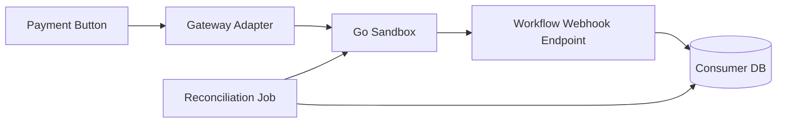

# Story: Workflow Consumer Integration

## Intent

Create the consumer-side integration, local persistence, and reconciliation loop that talks to the sandbox.

## Current Status

- Story 04 is complete, so the consumer can rely on the sandbox transaction report and reconciliation snapshot export.
- The consumer integration reference artifacts cover inbox-first processing, delivery idempotency, and reconciliation.
- Production Rails integration remains pending.

## Scope

### In Scope

- [ ] Workflow consumer client
- [ ] Local payment intents and attempts
- [ ] Webhook inbox
- [ ] Reconciliation job
- [ ] Adapter error mapping
- [ ] Local idempotency key tracking
- [ ] OpenAPI contract consumption

### Out of Scope

- [ ] Provider-specific SDKs
- [ ] UI changes beyond the existing payment button flow
- [ ] Provider-specific payment logic
- [ ] Webhook dispatcher implementation in the sandbox
- [ ] Non-v1 contract changes

## System Design

## Explanation

1. The existing payment button uses a gateway adapter instead of calling the sandbox directly.
2. The consumer keeps its code decoupled from the Go implementation through a versioned API contract.
3. Webhooks update local state asynchronously after the initial request.
4. A reconciliation job compares local data with sandbox reports.
5. The adapter boundary makes it easy to later swap in Stripe or Mercado Pago.

## Contract Notes

- The consumer should expose a small, explicit interface for payment operations.
- The consumer must persist a local idempotency key per request to avoid duplicate effects.
- Adapter errors should be normalized to a small set of domain-level failures.
- Payment attempts and webhook inbox entries should remain queryable for debugging.
- The reconciliation job must compare sandbox truth with consumer projections, not with UI state.
- The contract is versioned as `v1` from the URL and OpenAPI spec name onward.

## Acceptance Criteria

- [ ] The consumer can drive the sandbox through a gateway interface.
- [ ] Local payment state is persisted consistently.
- [x] Reconciliation can detect mismatches. [Evidence](./workflow_reconciliation.rb)
- [x] Duplicate requests do not duplicate payment side effects. [Evidence](./workflow_inbox.rb)
- [ ] Adapter errors are mapped into stable consumer domain errors.
- [x] Payment attempts and reconciliation snapshots can be inspected locally. [Evidence](./workflow_reconciliation.rb)

## Implementation Evidence

The story includes framework-independent Ruby reference artifacts for the Rails handoff:

- [Workflow consumer contract](./CONTRACT.md)
- [Inbox processor](./workflow_inbox.rb)
- [Inbox tests](./workflow_inbox_test.rb)
- [Reconciliation reference](./workflow_reconciliation.rb)
- [Reconciliation tests](./workflow_reconciliation_test.rb)

These files define and exercise the expected consumer behavior but are not integrated into the production Rails application.

## Dependencies

- [x] Sandbox API base
- [x] Webhook delivery
- [x] Ledger and reporting
- [x] OpenAPI v1 contract

## Related Docs

- [Implementation Checklist](./IMPLEMENTATION_CHECKLIST.md)
- [Contract](./CONTRACT.md)
- [Pattern](./PATTERN.md)
- [OpenAPI Guide](./OPENAPI.md)
- [SDK Proposal](./SDK_PROPOSAL.md)
- [SDK Migration Plan](./SDK_MIGRATION_PLAN.md)
