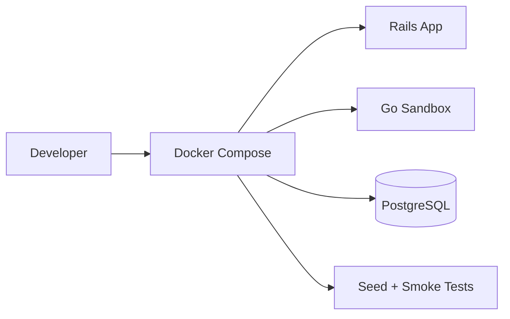

# Story: Local Dev Setup

## Intent

Make the sandbox and Rails app runnable locally with Docker Compose.

## Scope

### In Scope

- [ ] Docker Compose services
- [ ] Local PostgreSQL
- [ ] Local scenario seeds
- [ ] Smoke test scripts

### Out of Scope

- [ ] Cloud deployment
- [ ] Production observability stack

## System Design

## Explanation

1. Docker Compose starts the local environment with all required services.
2. Rails and the Go sandbox share the same local network and database dependencies.
3. Seed data provides deterministic test scenarios.
4. Smoke tests verify the basic payment flow before feature work begins.
5. This setup keeps the MVP reproducible for development and demos.

## Acceptance Criteria

- [ ] The full stack runs with one local command.
- [ ] Seeded scenarios are available.
- [ ] Smoke tests validate the happy path.

## Dependencies

- [ ] Sandbox API base
- [ ] Rails adapter
- [ ] Scenario engine
