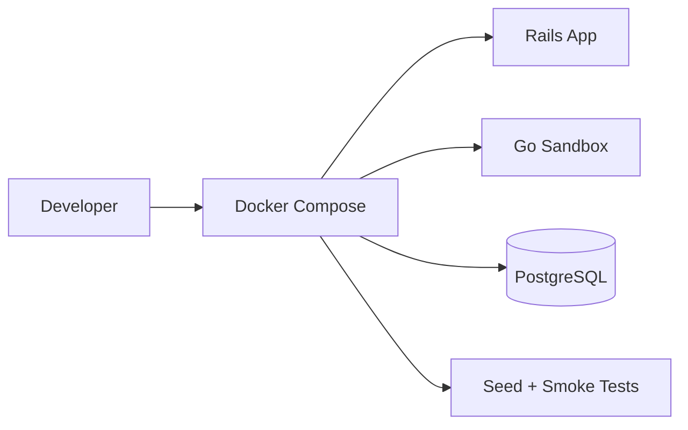

# Story: Local Dev Setup

## Intent

Make the sandbox and Rails app runnable locally with Docker Compose.

## Setup Decision

- `docker-compose.yml`, `.env.example`, and the project-level development README belong at the repository root.
- Stack operations use namespaced Make targets: `make stack/up`, `make stack/down`, and `make stack/seed`.
- The Rails application is documented as an external consumer because it is not part of this repository.
- The host-facing sandbox URL is `http://localhost:8080`; Compose services use `http://payment-sandbox:8080`.

## Implementation Order

1. Define the Compose services and health dependencies.
2. Add reproducible local environment variables.
3. Add deterministic seeds through the existing `payment-sandbox seed` command.
4. Add smoke tests for health, payment lifecycle, report, and snapshot.
5. Add Make targets for startup, shutdown, seeding, and reset.

## Scope

### In Scope

- [x] Docker Compose services ([evidence](../../../../../../docker-compose.yml))
- [x] Local PostgreSQL ([evidence](../../../../../../docker-compose.yml))
- [x] Local scenario seeds ([evidence](../../../../../../apps/payment-sandbox/internal/application/operations/seed.go))
- [ ] Smoke test scripts
- [x] One-command startup for the full stack ([evidence](../../../../../../Makefile))
- [x] Local env config for Rails and Go ([evidence](../../../../../../.env.example))

### Out of Scope

- [ ] Cloud deployment
- [ ] Production observability stack
- [ ] Kubernetes or staging infrastructure
- [ ] CI/CD pipeline automation

## System Design

## Explanation

1. Docker Compose starts the local environment with all required services.
2. Rails and the Go sandbox share the same local network and database dependencies.
3. Seed data provides deterministic test scenarios.
4. Smoke tests verify the basic payment flow before feature work begins.
5. This setup keeps the MVP reproducible for development and demos.
6. Local config should make it easy to switch between fake and sandbox providers.

## Contract Notes

- The full stack should start with a single local command.
- Rails and Go must use predictable local hostnames and ports.
- Seed data should include at least one happy-path and one failure-path scenario.
- Smoke tests should prove the basic payment loop end to end.
- The setup should be simple enough to reset from scratch.

## Acceptance Criteria

- [x] The full stack runs with one local command. ([evidence](../../../../../../Makefile))
- [x] Seeded scenarios are available. ([evidence](../../../../../../apps/payment-sandbox/internal/application/operations/seed.go))
- [ ] Smoke tests validate the happy path.
- [x] Local config is documented and reproducible. ([evidence](../../../../../../.env.example))
- [x] The developer can reset the environment without manual cleanup. ([evidence](../../../../../../Makefile))

## Dependencies

- [x] Sandbox API base
- [ ] Rails adapter (external to this repository)
- [x] Scenario engine
- [x] Ledger and reporting
