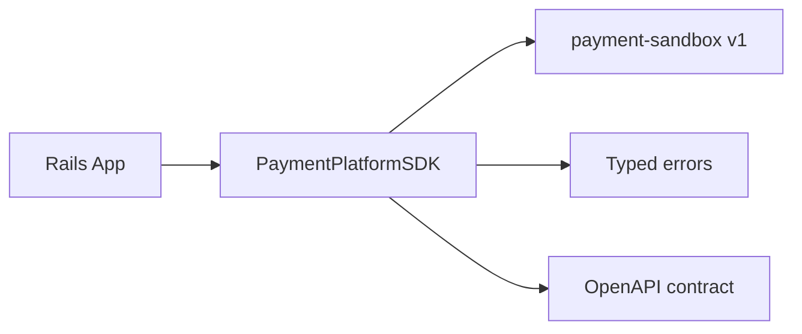

# Story: PaymentPlatformSDK

## Intent

Build a small, public Ruby gem that wraps `payment-sandbox` v1 for reuse from the Rails app and any future Ruby consumer.

## Scope

### In Scope

- [ ] Public Ruby gem packaging and versioning.
- [ ] HTTP client for OpenAPI `v1` payment operations.
- [ ] Typed error mapping with stable codes and status.
- [ ] Configurable base URL, auth, tenant scope, timeout, and retries.
- [ ] Automatic idempotency key support for mutating requests.
- [ ] Request/response tests against the sandbox contract.
- [ ] Usage docs and examples for Rails integration.

### Out of Scope

- [ ] Webhook inbox and reconciliation logic.
- [ ] Provider-specific business rules.
- [ ] UI changes in Rails.
- [ ] Non-v1 contract changes.

## Package Shape

```ruby
PaymentPlatform::Client.new(
  base_url: ENV.fetch("PAYMENT_PLATFORM_BASE_URL"),
  api_key: ENV.fetch("PAYMENT_PLATFORM_API_KEY"),
  tenant_id: ENV["PAYMENT_PLATFORM_TENANT_ID"],
  timeout: 5,
  retries: 2
)
```

## Proposed API

- `create_payment_intent`
- `confirm_payment_intent`
- `capture_payment_intent`
- `create_refund`
- `get_payment_intent`

## System Design



## Explanation

1. Rails depends on the gem, not on raw HTTP calls.
2. The gem maps a tiny Ruby API to the OpenAPI `v1` contract.
3. The gem handles auth, retries, tenant scope, and idempotency in one place.
4. Contract tests keep the gem aligned with the sandbox and prevent drift.
5. The package can be published and reused without exposing sandbox internals.

## Acceptance Criteria

- [ ] The gem can create, confirm, capture, refund, and fetch payment intents.
- [ ] Configuration supports base URL, auth, tenant scope, timeout, and retries.
- [ ] Mutating requests automatically support idempotency.
- [ ] Errors are stable and usable from Rails.
- [ ] Tests prove the gem matches the OpenAPI `v1` contract.
- [ ] The gem can be versioned and released independently.

## Dependencies

- [x] OpenAPI v1 contract
- [x] Browser docs views
- [ ] Rails payment flow integration

## Related Docs

- [Implementation Checklist](./IMPLEMENTATION_CHECKLIST.md)
- [Workflow Consumer Integration](../05-workflow-consumer-integration/README.md)
- [SDK Proposal](../05-workflow-consumer-integration/SDK_PROPOSAL.md)

## Risks

- Contract drift between gem and sandbox.
- API surface growing beyond the small public client boundary.
- Release/versioning complexity if the gem is not kept thin.
